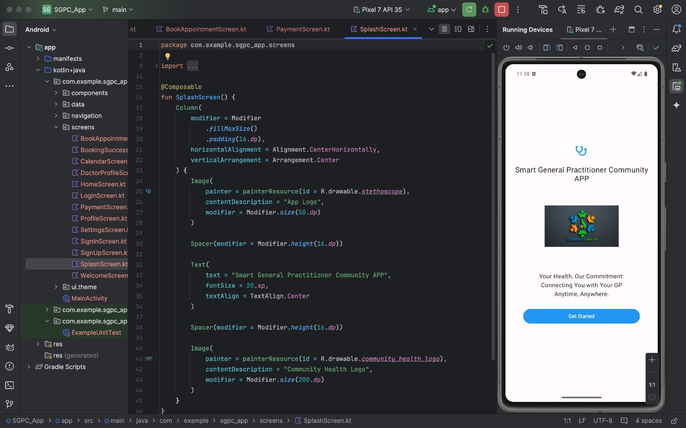
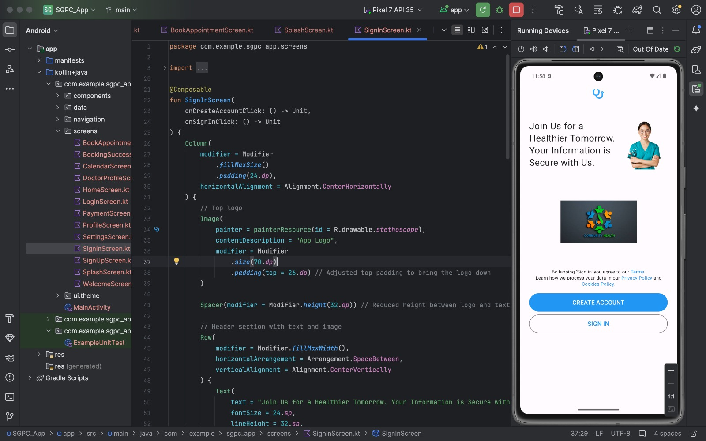
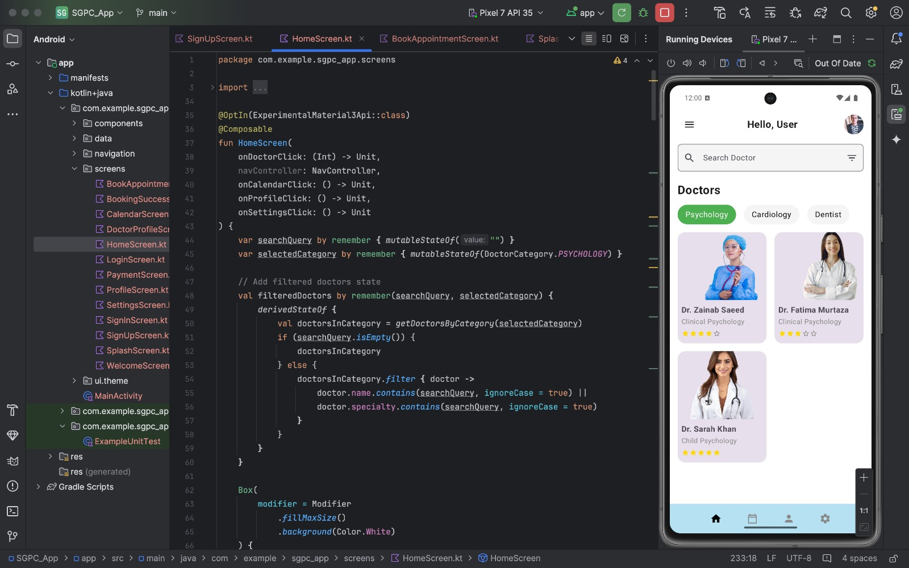
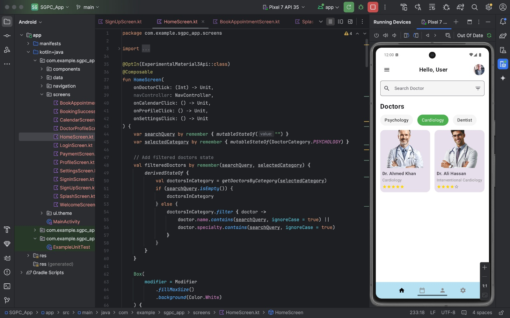
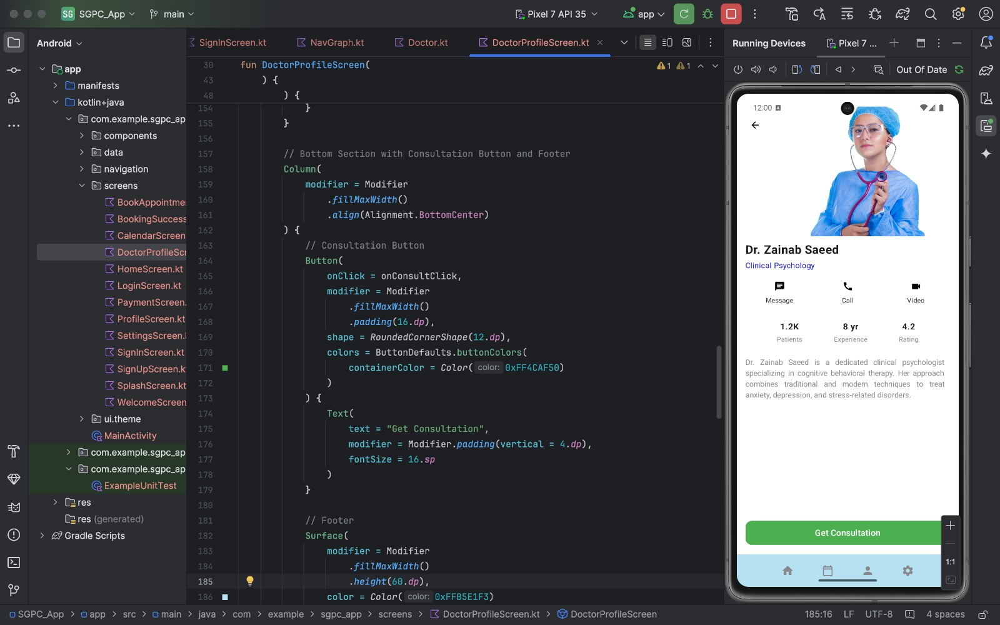
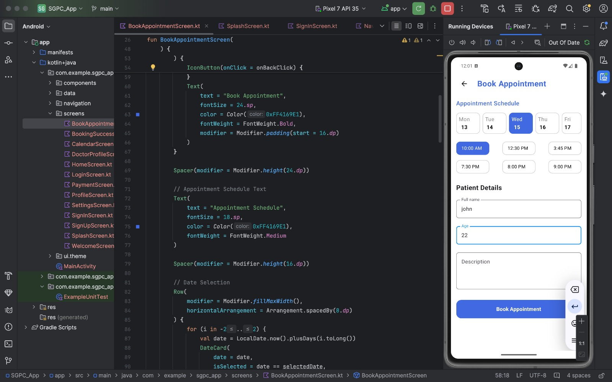
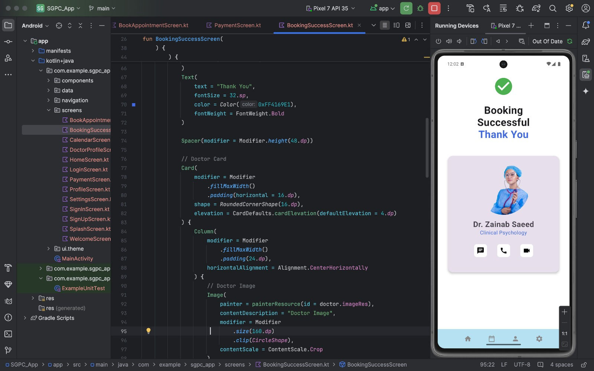
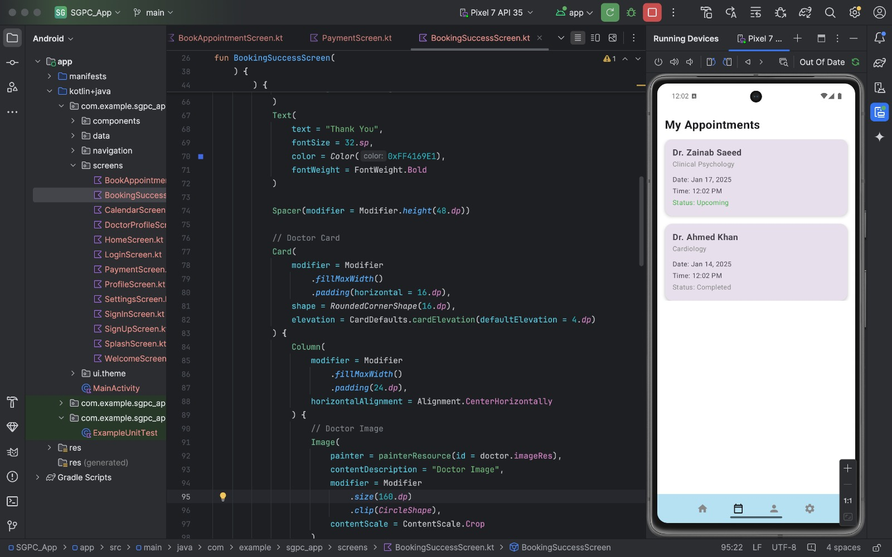

# Smart General Practitioner Community (SGPC) Native Android Telehealth Application

## Overview

Modern healthcare delivery requires efficient, secure, and intuitive digital interfaces connecting patients with licensed general practitioners, medical specialists, and clinical consultation services.

This project implements the **Smart General Practitioner Community (SGPC)** native Android mobile application engineered using Kotlin, Android Jetpack components, and the Model-View-ViewModel (MVVM) architectural pattern. The application features patient authentication, verified doctor directory browsing, interactive appointment scheduling, in-app telehealth consultation workflows, and clinical profile management.

---


---

## Problem Statement

Patients and healthcare providers frequently experience fragmented scheduling workflows, lack of transparent specialist directory access, and friction in telehealth booking systems. Healthcare organizations require a secure, production-grade native Android mobile application architected with clean Model-View-ViewModel (MVVM) principles that provides seamless patient onboarding, credential-verified doctor directory discovery, real-time appointment scheduling, and digital medical history management.

## System Architecture and Workflow

```
[ User Interaction (Activities & Fragments) ]
 |
 v
[ View Layer: ViewBinding / DataBinding / Jetpack UI Components ]
 |
 v (Observes State via LiveData / StateFlow)
[ ViewModel Layer: State Management & Coroutine Asynchronous Tasks ]
 |
 v
[ Repository Layer: Single Source of Truth ]
 | |
 v v
[ Local Data Source (Room Database) ] [ Remote API (Retrofit / REST Client) ]
```

---

## Application Screens & User Journey

### 1. Onboarding & Patient Authentication



*Interpretation*: Intuitive onboarding screens providing biometric and credential-based patient login, registration, and security verification.

### 2. Clinical Home Dashboard & Specialist Discovery



*Interpretation*: The primary dashboard provides instant search, medical category filtering (Cardiology, Dermatology, General Practice, Pediatrics), and upcoming appointment reminders.

### 3. Doctor Profile & Real-Time Appointment Booking



*Interpretation*: Dedicated practitioner profile pages display clinical credentials, verified patient reviews, consultation fees, and real-time appointment slot reservation calendars.

### 4. Appointment Confirmation & Telehealth Management



*Interpretation*: Confirmed booking state with calendar integration, automated notifications, and appointment management history.

---

## Key Features

- **MVVM Clean Architecture**: Decouples UI presentation from business logic and data repositories, ensuring robust unit testability and modular maintenance.
- **Doctor Directory & Search Engine**: Multi-criteria filtering by medical specialty, rating, consultation fee, and geographic proximity.
- **Interactive Appointment Booking**: Time-slot reservation system with conflict prevention and automated calendar synchronization.
- **Patient Health Record Profile**: Secure client-side storage of medical history, emergency contacts, and active prescriptions.
- **Native Android Performance**: Built with Kotlin Coroutines for asynchronous network operations and zero frame-drop UI rendering.

---

## Technical Specifications

| Parameter | Specification |
| :--- | :--- |
| **Language** | Kotlin 1.9+ |
| **Min SDK** | API 24 (Android 7.0 Nougat) |
| **Target SDK** | API 34 (Android 14) |
| **Architecture** | MVVM (Model-View-ViewModel) |
| **Build System** | Gradle Kotlin DSL (`build.gradle.kts`) |
| **Jetpack Libraries** | ViewModel, LiveData, ViewBinding, Navigation Component |
| **Networking & Async** | Retrofit 2, OkHttp 3, Kotlin Coroutines |
| **Binary Artifact** | Compiled Debug APK (`Final/app-debug.apk`) |

---

## Project Structure

```
smart-general-practitioner-app/
├── Archive/
│ └── Final/
│ ├── SGPC_App/ # Complete Android Studio Gradle project
│ │ ├── app/
│ │ │ ├── build.gradle.kts
│ │ │ └── src/ # Kotlin source code, layouts, and manifests
│ │ ├── build.gradle.kts # Root project build configuration
│ │ └── settings.gradle.kts
│ ├── app-debug.apk # Pre-compiled standalone Android APK
│ └── Video.webm # Complete application walkthrough recording
├── screenshots/ # Real device execution screenshots
│ ├── welcome_screen.jpeg
│ ├── Signin.jpeg
│ ├── home_screen.jpeg
│ ├── doctor_profile_screen.jpeg
│ ├── book_appointment_screen.jpeg
│ ├── booking_sucess.jpeg
│ └── my_appointments_screen.jpeg
└── README.md # System documentation
```

---

## Usage Guide

1. Launch application on device or emulator.
2. Complete patient registration or sign in with existing credentials.
3. Browse the medical specialist directory by department or search query.
4. Select a physician profile to inspect credentials, ratings, and consultation fees.
5. Choose an available calendar time-slot and confirm appointment reservation.

## Installation and Build Setup

### 1. Prerequisites
- Android Studio Hedgehog (2023.1.1) or newer
- Android SDK Build-Tools 34.0.0
- JDK 17 (Java Development Kit)

### 2. Open Project in Android Studio
```bash
git clone https://github.com/AbdulRehmanRattu/Smart-General-Practitioner-Android-App.git
```
1. Launch **Android Studio**.
2. Select **Open** and navigate to `Archive/Final/SGPC_App`.
3. Allow Gradle to sync dependencies automatically.

### 3. Build & Run Application
- Connect an Android physical device with USB debugging enabled or launch an Android Virtual Device (AVD).
- Click **Run 'app'** (`Shift + F10`) to compile and install the application.
- Alternatively, install the pre-compiled APK directly:
```bash
adb install Archive/Final/app-debug.apk
```
